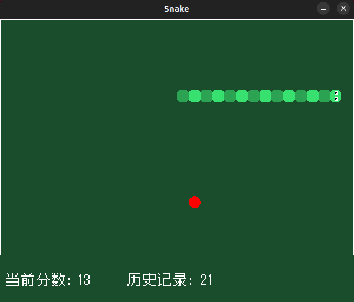
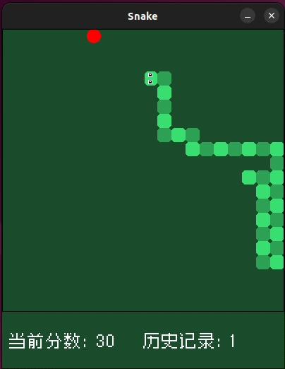

# 贪吃蛇小游戏 \(SDL2\)

基于 SDL2 开发的经典贪吃蛇小游戏

**游戏截图**

## 基础介绍
- 经典贪吃蛇玩法：移动、吃食物、撞墙/撞自身死亡
- 游戏暂停设置：支持调节移动速度、开关穿墙模式

## 运行方式
### Windows
Windows需要手动下载 SDL2 库，放置在对应目录，具体过程可以参考：https://www.cnblogs.com/shumei52/p/18604909 \
执行一键编译脚本 `.\build.bat`\，即可编译运行游戏\
项目依赖官方 SDL2 系列库，可自行下载对应版本：
- SDL2：https://github.com/libsdl-org/SDL/releases
- SDL2_image：https://github.com/libsdl-org/SDL_image/releases
- SDL2_ttf：https://github.com/libsdl-org/SDL_ttf/releases
- SDL2_mixer：https://github.com/libsdl-org/SDL_mixer/releases

### Linux
Linux 下载对应库后执行 `./build.sh` 即可编译运行游戏。

## 项目结构
- main.cpp：程序入口、资源初始化与释放、主循环
- render.h/cpp：统一渲染工具、所有场景绘制逻辑
- scene.h/cpp：场景事件、交互逻辑、界面跳转
- snake.h/cpp：贪吃蛇核心移动、碰撞、生长逻辑
- food.h/cpp：食物随机生成
- config.h：全局常量、窗口配置、资源路径
- log.h：重定向输出到文件
- build 脚本：跨平台编译配置

## 资源来源
- font: https://github.com/SolidZORO/zpix-pixel-font/releases
- 标题图像：https://fontvibe.ai/zh/tools/pixel-fonts
- 其他图像：https://www.piskelapp.com/p/create/sprite/
- 食物音频：https://freesound.org/people/keweldog/sounds/182861/
- 碰撞音频: https://www.bfxr.net/

## 新功能-SnakeAI
 \
参考:
- https://www.bilibili.com/opus/136884718010115963

实现在Snake::Auto函数中，原本算法思路如下：
```
计算最短路径
if 能吃到食物
    if 虚拟蛇沿最短路径吃食物后能找到尾巴
        沿着最短路径走一步
elif 能找到尾巴
    沿到达蛇尾的最长路径向蛇尾走一步
elif 食物尾巴都不能吃到
    随便找可行位置走一步
```
食物和尾巴都吃不到对应的情况是: 计算出一条最短路径，吃到食物后能看到尾巴，这是没问题的。问题在于，每走一步就要重新计算最短路径，在后续过程中可能选择了相同长度但吃完食物后无法看到尾巴的路径，此时若无法看到尾巴，就会出现食物和尾巴都无法到达的情况。\
因此，进行改进：若能吃到食物且虚拟蛇沿最短路径吃食物后能找到尾巴，则保存这条路径直接走完，不要在重复计算。这样可以保证，蛇头一定能找到蛇尾，避免随便走一步。新思路：
```
if 路径缓存非空
    沿路径走一步
    return
计算最短路径
if 能吃到食物 && 虚拟蛇沿最短路径吃食物后能找到尾巴
    保存路径缓存
    沿着最短路径走一步
else
    计算蛇尾到其他位置的距离
    沿到达蛇尾的最长路径向蛇尾走一步
```